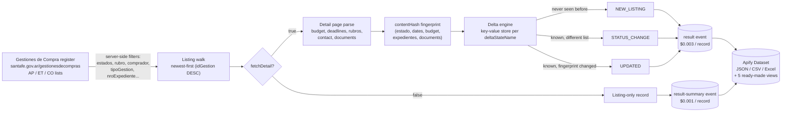

<div align="center">

# Santa Fe Argentina Licitaciones - Tender Delta API

**A stateful monitor for every public tender, concurso and contratación directa published by the Province of Santa Fe, Argentina**

[](https://apify.com)
[](https://apify.com/stefano_seggio/santafe-compras-monitor)
[](https://www.typescriptlang.org/)
[](LICENSE)

[](https://apify.com/stefano_seggio/santafe-compras-monitor)

Actor console (owner reference): [console.apify.com/actors/jfoq1flE7KqKb3qAb](https://console.apify.com/actors/jfoq1flE7KqKb3qAb)

</div>

---

**This Actor monitors the Province of Santa Fe, Argentina's official public-tender register (Gestiones de Compra) and delivers new, status-changed and amended tenders as a delta feed, on whatever recurring schedule you configure through Apify's own Scheduler.**

## Santa Fe government tenders, turned into a feed you can actually monitor

The Province of Santa Fe, Argentina publishes every public procurement process - licitaciones públicas, licitaciones privadas, contrataciones directas, concursos de precios and more - on one official register, *Gestiones de Compra* (`santafe.gov.ar/gestionesdecompras`). The portal has no RSS feed, no e-mail alerts and no documented API, its search form silently defaults to the current year, and the only export is a plain CSV with no ids, no amounts and no document links. Tracking a rubro or a set of buyers today means re-opening the AP / ET / CO lists by hand across dozens of ministries, hospitals and SAMCOs, then re-reading each process page just to notice a circular aclaratoria or a moved opening date - work that stops scaling past a handful of buyers.

**santafe-compras-monitor** is an Apify Actor that turns that register into structured, queryable public-procurement data: buyer, budget, deadlines, rubros, expediente numbers and direct links to pliegos, circulares and actas, all in one JSON/CSV record per process. Point it at the AP (Para Apertura), ET (En Trámite) or CO (Concluida) lists, filter by rubro, buyer or procedure type the same way the site's own search form does, and put it on a schedule: its delta mode returns, on every run, only the tenders that are new, changed status, or amended since the previous run - so a person checks one feed instead of the portal, list by list.

It is built for the three groups who watch this register today: suppliers to the provincial health system (pharma, medical-supply, lab, cleaning and food vendors to hospitals and SAMCOs) filtering by rubro and submission deadline to decide bid or no-bid inside a short window; construction, IT, security and facility-service contractors searching by objeto or comprador and checking budget and electronic-bid eligibility before routing an opportunity to a sales owner; and bid consultants (*gestores de licitaciones*) who need to know the instant a tracked tender gets a new circular, an acta de apertura, or a moved opening date, before a draft offer goes stale.

## Architecture



## What's inside

| Feature | Grounded in |
| --- | --- |
| Server-side filters mirroring the site's own search form | `estados` (AP/ET/CO), `tipoGestion` (13 procedure codes), `tipoModalidad`, `comprador` / `solicitante` (resolved by id or name against the site's own organism list), `rubro` / `subrubro`, `nroGestion`, `nroExpediente` |
| Delta / monitoring mode | `onlyNew: true` walks each list newest-first and delivers only `NEW_LISTING`, `STATUS_CHANGE` (a process moved AP → ET → CO) or `UPDATED` (an amended detail page) events, filterable via `eventTypes` |
| Full detail enrichment | `fetchDetail: true` opens each process page for publication date, budget (`montoOriginalAmount`), submission deadline, rubros, requesting organism, contact info and expediente |
| Amendment detection without a "last modified" signal | `recheckWindowDays` re-reads the detail page of every known process opening soon, compares a `contentHash` fingerprint, and delivers only real changes - re-checks that find nothing are not charged |
| Direct document links | `documents[]` with a normalised `kind` (pliego, circular, acta de apertura, cuadro comparativo, preadjudicación, adjudicación, orden de provisión...) and `hasPliego` / `hasCircular` / `hasAdjudicacion` flags |
| Opening-date window | `openingFrom` / `openingTo`, absolute (`2026-09-01`) or relative (`+7 days`), computed on the Santa Fe calendar |
| Configurable concurrency | `maxConcurrency` (1-10) - the site tolerates 10 parallel detail requests without throttling; a 500-record run finishes in under a minute |
| Ready-made views | Overview, Deadlines & openings, Documents & awards, Buyers & contacts, and Status changes & amendments, plus CSV/Excel export from the Output tab or API |

## Cost & BYOK Disclosure

This Actor is pay-per-event, not pay-per-compute-unit - platform usage is included in the event price:

| Event | Price | Charged when |
| --- | --- | --- |
| `result` | **$0.003** per record | A record built from the full detail page (buyer, budget, deadline, rubros, documents, fingerprint) |
| `result-summary` | **$0.001** per record | A listing-only record (`fetchDetail: false`, or a process the site reports as not yet published) |

- **No third-party API key required.** This Actor's `byok` status is `none` — everything it needs to run is included; there is no external service key to obtain, configure, or pay for separately.
- **Unchanged records are never billed.** Every known process's detail page is compared against a persisted SHA-1 `contentHash` fingerprint from this Actor's own last run. A re-check (`recheckWindowDays`) that finds no change is not charged, and a quiet monitoring run that surfaces nothing new, status-changed or amended stays essentially free.
- Setting `fetchDetail: false` trims every delivered record to the cheaper `result-summary` tier when only the listing fields are needed.

## Quickstart

Get an Apify API token from your account's **Settings → Integrations** page (or run `apify login` with the Apify CLI). All three examples below call the real Actor at `stefano_seggio/santafe-compras-monitor` with a filtered monitoring input — hospital medicines and medical supplies, delta mode.

### cURL

Runs synchronously and returns the resulting dataset items directly in the response - no polling needed.

```bash
curl -X POST "https://api.apify.com/v2/acts/stefano_seggio~santafe-compras-monitor/run-sync-get-dataset-items?token=<YOUR_API_TOKEN>" \
  -H "Content-Type: application/json" \
  -d '{
  "maxItems": 50,
  "onlyNew": true
}'
```

### Python (`apify_client`)

```python
from apify_client import ApifyClient

client = ApifyClient("<YOUR_API_TOKEN>")

run = client.actor("stefano_seggio/santafe-compras-monitor").call(run_input={
    "estados": ["AP", "ET"],
    "rubro": "medicinales",
    "onlyNew": True,
    "recheckWindowDays": 30,
    "maxItems": 300,
    "fetchDetail": True,
})

for item in client.dataset(run["defaultDatasetId"]).iterate_items():
    print(item["event_type"], item["objeto"], item["comprador"])
```

### Node.js (`apify-client`)

```javascript
import { ApifyClient } from 'apify-client';

const client = new ApifyClient({ token: process.env.APIFY_TOKEN });

const run = await client.actor('stefano_seggio/santafe-compras-monitor').call({
  estados: ['AP', 'ET'],
  rubro: 'medicinales',
  onlyNew: true,
  recheckWindowDays: 30,
  maxItems: 300,
  fetchDetail: true,
});

const { items } = await client.dataset(run.defaultDatasetId).listItems();
for (const item of items) {
  console.log(item.event_type, item.objeto, item.comprador);
}
```

Or a broad daily sweep of every new, changed or amended open tender across the province: `{ "estados": ["AP", "ET"], "onlyNew": true, "maxItems": 500 }`. Equivalent Node.js (`run-monitor.js`) and Python (`run_monitor.py`) scripts are also included in this repository under [`examples/`](examples) — set `APIFY_TOKEN` in your environment first (`apify auth token` if you use the CLI, or from the Apify Console's Integrations tab).

## Input & Output Schema

### Input

| Field | Type | Default | Description |
| --- | --- | --- | --- |
| `estados` | array | `["AP"]` | Which lists to read: `AP` (Para Apertura, published/not yet opened), `ET` (En Trámite, opened/being evaluated), `CO` (Concluida, finished). |
| `anio` | integer | *(current year on the site; empty here = all years)* | Year of the process number (`anioGestion`). |
| `objeto` | string | — | Case-insensitive phrase search over the tender subject. |
| `tipoGestion` | array | `[]` | Procedure type codes (`L` = Licitación Pública, `P` = Licitación Privada, `T` = Contratación Directa, and others). |
| `tipoModalidad` | string | — | Contracting modality code from the site. |
| `comprador` | string | — | Organism running the procedure, by site id or name (matched at run start; ambiguous names fail with candidates listed). |
| `solicitante` | string | — | Organism the purchase is for; same id/name matching as `comprador`. |
| `rubro` | string | — | Product/service category, by `idEspecie` or name (matched against the site's 78 rubros). |
| `subrubro` | string | — | Sub-category within `rubro`; requires `rubro` to be set. |
| `nroGestion` | string | — | Exact process number as printed on the site (combine with `anio`). |
| `nroExpediente` | string | — | Exact, full expediente number. |
| `openingFrom` / `openingTo` | string | — | Client-side window on bid-opening date; absolute (`2026-09-01`) or relative (`+7 days`). |
| `eventTypes` | array | `["NEW_LISTING","STATUS_CHANGE","UPDATED"]` | Which delta events to deliver (delta mode only). |
| `onlyNew` | boolean | `false` | Delta mode: deliver only new, status-changed or amended processes since the last run for this filter set. |
| `recheckWindowDays` | integer | `30` | Re-reads the detail page of known, soon-opening processes to catch amendments; `0` disables it. Free when nothing changed. |
| `sortBy` | string | `"newest"` | `newest` (required for delta mode), `openingSoonest`, `openingLatest`, or `mostViewed` (full runs only). |
| `deltaStateName` | string | fingerprint of your filters | Names the persisted delta memory so different schedules don't interfere. |
| `resetState` | boolean | `false` | Forgets this delta state and re-baselines from scratch. |
| `maxItems` | integer | `100` | Hard cap on delivered records (and therefore cost). |
| `fetchDetail` | boolean | `true` | Fetch each process's detail page for the full field set. Off = cheaper listing-only `result-summary` records. |
| `maxConcurrency` | integer | `5` | How many detail pages are fetched in parallel (1-10). |
| `dateRange` | string | — | Legacy (v1) opening-date window: `"24h"`, `"7d"`, or `"30d"` before **and** after today. |

See [`.actor/input_schema.json`](.actor/input_schema.json) for the full, authoritative schema.

### Output

One real record, trimmed for length below — every record actually carries 84 fields; see [`.actor/dataset_schema.json`](.actor/dataset_schema.json) for the complete shape:

```json
{
  "record_id": "139031",
  "event_type": "NEW_LISTING",
  "scraped_at": "2026-09-08T07:24:09.044Z",
  "source_url": "https://www.santafe.gov.ar/gestionesdecompras/site/gestion.php?idGestion=139031",
  "estado": "AP",
  "tipoGestion": "LICITACIÓN PÚBLICA",
  "numeroAnio": "06-2026",
  "objeto": "CONTRATACIÓN DE UN SERVICIO DE MANTENIMIENTO PREVENTIVO Y CORRECTIVO PARA CENTRAL TELEFÓNICA...",
  "comprador": "MINISTERIO DE GOBIERNO E INNOVACIÓN PÚBLICA",
  "openingAt": "2026-09-28T13:00:00.000Z",
  "daysUntilOpening": 20,
  "montoOriginalAmount": 60000,
  "montoOriginalCurrency": "USD",
  "rubros": [{ "rubro": "EQUIPOS Y ACCESORIOS DE COMUNICACION", "subrubro": "EQUIPOS Y ACCESORIOS DE COMUNICACION" }],
  "expediente": "EE-2026-00006835-APPSF-PE",
  "isElectronic": true,
  "bidUrl": "https://gestionvirtual.santafe.gob.ar/#/bandeja_proveedores/create/form/680a87a12a055d2295ea39a0?expedienteCode=EE-2026-00006835-APPSF-PE",
  "documents": [
    { "kind": "pliego", "nombre": "PLIEGO ÚNICO DE BASES Y CONDICIONES GENERALES", "url": "https://www.santafe.gov.ar/gestionesdecompras/descargar.php?m=anexo&id=171910&hash=8cd5df74023f7e1c8c86cc954d783796&panel=0" }
  ],
  "documentCount": 4,
  "hasPliego": true,
  "hasCircular": false,
  "contentHash": "62c66a944a7fd695e0dbfe1cefec285c945fda10"
}
```

| Field | Type | Description |
| --- | --- | --- |
| `record_id` | string | This dataset record's id — the site's `idGestion`. |
| `event_type` | string | `NEW_LISTING`, `STATUS_CHANGE`, or `UPDATED` (delta mode); carries `previousEstado` on a `STATUS_CHANGE`. |
| `scraped_at` | string (ISO 8601) | When this run fetched the record. |
| `source_url` | string | Direct link to the process's page on `santafe.gov.ar`. |
| `estado` | string | Current list the process is in: `AP`, `ET`, or `CO`. |
| `tipoGestion` | string | Procedure type, e.g. `LICITACIÓN PÚBLICA`. |
| `numeroAnio` | string | Process number and year as printed on the site. |
| `objeto` | string | Free-text subject of the tender. |
| `comprador` | string | Requesting/buying organism. |
| `openingAt` | string (ISO 8601) | Bid-opening date/time. |
| `daysUntilOpening` | integer | Days from `scraped_at` to `openingAt`. |
| `montoOriginalAmount` / `montoOriginalCurrency` | number / string | Budget amount and its currency. |
| `rubros` | array | Product/service categories and sub-categories covered. |
| `expediente` | string | Official expediente (case file) number. |
| `isElectronic` | boolean | Whether bids are submitted through the electronic portal (`bidUrl`). |
| `bidUrl` | string or null | Direct link to submit an electronic bid, when applicable. |
| `documents` | array | Attached documents, each with a normalized `kind` (pliego, circular, acta, etc.), `nombre`, and `url`. |
| `documentCount` | integer | Number of attached documents. |
| `hasPliego` / `hasCircular` | boolean | Quick flags for whether a pliego / circular is attached. |
| `contentHash` | string | SHA-1 fingerprint of the process's tracked detail fields, used to detect `UPDATED` across runs. |

A status change carries `event_type: "STATUS_CHANGE"` and `previousEstado`; an amendment carries `event_type: "UPDATED"`, `is_new: false` and typically `hasCircular: true` or a new `openingNote` such as `(*** NUEVA FECHA ***)`.

## Why not just scrape it yourself

- **Zero infrastructure.** No server to provision, no headless browser to keep patched, no Crawlee project to maintain - the Actor runs on Apify's platform and the crawling logic above is already handled.
- **Managed scheduling.** Put it on an Apify schedule once and every run since the first is a delta against the previous one, with no cron box or database of your own to babysit.
- **No proxy or session babysitting.** The register is a plain server-rendered site with no login wall, but request pacing, retries (network/408/425/429/5xx only) and timeouts (45 s listing, 30 s detail) are already tuned so a run doesn't silently stall or get throttled.
- **Built-in delta and change detection you'd otherwise have to build.** A per-filter-set key-value store remembers every delivered process with its estado and a content fingerprint, detects status transitions even for processes that vanish from the AP/ET lists, and survives a spending-limit stop or platform migration mid-run without losing or duplicating a record - that state machine is most of the actual engineering effort here.

## Contributing & Local Setup

This repository contains the Actor's real, buildable TypeScript source under `src/` — cloning it gets you the actual crawler, delta-engine and fingerprinting logic, not just documentation:

```bash
git clone https://github.com/stefanoseggio/santafe-compras-monitor.git
cd santafe-compras-monitor
npm install
apify login    # one-time; stores your Apify token locally
apify run --purge --input '{"estados":["AP"],"maxItems":20,"fetchDetail":false}'
```

Before opening a pull request, run this repo's own checks, in order:

```bash
npm run build      # tsc — catches type errors
npm run lint       # ESLint (@apify/eslint-config)
npm test           # Vitest unit tests
npm run test:live  # optional: live tests against the real site (LIVE=1)
```

Then inspect `storage/datasets/default/*.json` from a local `apify run`, not just the log tail. `storage/` is local-only and is never synced to Apify Console; confirming real cloud behavior (delta state persistence across separate runs, scheduling, the full `recheckWindowDays` sweep) requires `apify push` to a build tag and a real run on the platform. Bug reports and feature requests go through the Issues tab on this repo or on Apify Store and are typically answered within about 48 hours.

## Known limitations

- **Opening-date filters are client-side.** `openingFrom` / `openingTo` are applied after the listing is fetched, because the register itself exposes no date filter - rows outside the window are skipped and never remembered, not queried more cheaply.
- **No true "last modified" signal.** The site publishes no modification timestamp, so amendment detection relies on periodically re-reading and fingerprinting each open process's detail page (`recheckWindowDays`) rather than a push notification from the source.
- **Name-based filters resolve at run start.** `comprador`, `solicitante`, `rubro` and `subrubro` accepted as free text are matched against the site's own organism/rubro lists when the run starts; an ambiguous name fails the run with the candidate matches listed instead of guessing.
- **Independently maintained, no contractual SLA.** This is a solo-maintained Actor, not an enterprise vendor product. Bug reports and feature requests go through the Issues tab on Apify Store and are typically answered within about 48 hours.

---

<div align="center">

**Part of [Delta Registry](https://github.com/stefanoseggio)** - pay-per-event regulatory & compliance data infrastructure turning fragmented, alert-less government registers across Latin America into monitorable, delta-aware APIs.

For professional inquiries or enterprise licensing: [linkedin.com/in/stefanoseggio-deltaregistry](https://www.linkedin.com/in/stefanoseggio-deltaregistry) · Rest of the fleet: [github.com/stefanoseggio](https://github.com/stefanoseggio)

</div>
