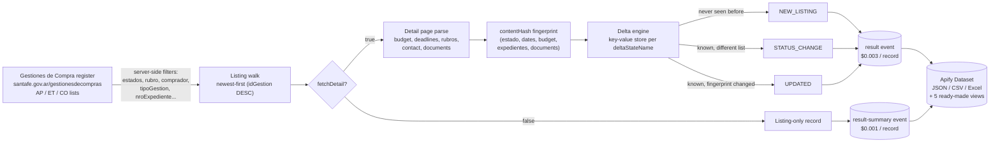

<div align="center">

# Santa Fe Argentina Licitaciones - Tender Delta API

**A stateful monitor for every public tender, concurso and contratación directa published by the Province of Santa Fe, Argentina**

[](https://apify.com)
[](https://apify.com/stefano_seggio/santafe-compras-monitor)
[](https://www.typescriptlang.org/)
[](https://github.com/stefanoseggio/santafe-compras-monitor/blob/main/LICENSE)

[](https://apify.com/stefano_seggio/santafe-compras-monitor)

Actor console (owner reference): [console.apify.com/actors/jfoq1flE7KqKb3qAb](https://console.apify.com/actors/jfoq1flE7KqKb3qAb)

</div>

---

## Santa Fe government tenders, turned into a feed you can actually monitor

The Province of Santa Fe, Argentina publishes every public procurement process - licitaciones públicas, licitaciones privadas, contrataciones directas, concursos de precios and more - on one official register, *Gestiones de Compra* (`santafe.gov.ar/gestionesdecompras`). The portal has no RSS feed, no e-mail alerts and no documented API, its search form silently defaults to the current year, and the only export is a plain CSV with no ids, no amounts and no document links. Tracking a rubro or a set of buyers today means re-opening the AP / ET / CO lists by hand across dozens of ministries, hospitals and SAMCOs, then re-reading each process page just to notice a circular aclaratoria or a moved opening date - work that stops scaling past a handful of buyers.

**santafe-compras-monitor** is an Apify Actor that turns that register into structured, queryable public-procurement data: buyer, budget, deadlines, rubros, expediente numbers and direct links to pliegos, circulares and actas, all in one JSON/CSV record per process. Point it at the AP (Para Apertura), ET (En Trámite) or CO (Concluida) lists, filter by rubro, buyer or procedure type the same way the site's own search form does, and put it on a schedule: its delta mode returns, on every run, only the tenders that are new, changed status, or amended since the previous run - so a person checks one feed instead of the portal, list by list.

It is built for the three groups who watch this register today: suppliers to the provincial health system (pharma, medical-supply, lab, cleaning and food vendors to hospitals and SAMCOs) filtering by rubro and submission deadline to decide bid or no-bid inside a short window; construction, IT, security and facility-service contractors searching by objeto or comprador and checking budget and electronic-bid eligibility before routing an opportunity to a sales owner; and bid consultants (*gestores de licitaciones*) who need to know the instant a tracked tender gets a new circular, an acta de apertura, or a moved opening date, before a draft offer goes stale.

## Architecture



## What's inside

| Feature | Grounded in |
| --- | --- |
| Server-side filters mirroring the site's own search form | `estados` (AP/ET/CO), `tipoGestion` (13 procedure codes), `tipoModalidad`, `comprador` / `solicitante` (resolved by id or name against the site's own organism list), `rubro` / `subrubro`, `nroGestion`, `nroExpediente` |
| Delta / monitoring mode | `onlyNew: true` walks each list newest-first and delivers only `NEW_LISTING`, `STATUS_CHANGE` (a process moved AP → ET → CO) or `UPDATED` (an amended detail page) events, filterable via `eventTypes` |
| Full detail enrichment | `fetchDetail: true` opens each process page for publication date, budget (`montoOriginalAmount`), submission deadline, rubros, requesting organism, contact info and expediente |
| Amendment detection without a "last modified" signal | `recheckWindowDays` re-reads the detail page of every known process opening soon, compares a `contentHash` fingerprint, and delivers only real changes - re-checks that find nothing are not charged |
| Direct document links | `documents[]` with a normalised `kind` (pliego, circular, acta de apertura, cuadro comparativo, preadjudicación, adjudicación, orden de provisión...) and `hasPliego` / `hasCircular` / `hasAdjudicacion` flags |
| Opening-date window | `openingFrom` / `openingTo`, absolute (`2026-09-01`) or relative (`+7 days`), computed on the Santa Fe calendar |
| Configurable concurrency | `maxConcurrency` (1-10) - the site tolerates 10 parallel detail requests without throttling; a 500-record run finishes in under a minute |
| Ready-made views | Overview, Deadlines & openings, Documents & awards, Buyers & contacts, and Status changes & amendments, plus CSV/Excel export from the Output tab or API |

## Quick start

Run it from the Apify CLI with a real, filtered monitoring input - hospital medicines and medical supplies, delta mode:

```bash
apify call santafe-compras-monitor --input '{
  "estados": ["AP", "ET"],
  "rubro": "medicinales",
  "onlyNew": true,
  "recheckWindowDays": 30,
  "maxItems": 300,
  "fetchDetail": true
}'
```

Or a broad daily sweep of every new, changed or amended open tender across the province:

```bash
apify call santafe-compras-monitor --input '{ "estados": ["AP", "ET"], "onlyNew": true, "maxItems": 500 }'
```

Node.js (`run-monitor.js`) and Python (`run_monitor.py`) equivalents that call the same Actor through `apify-client` are below.

## Sample output record

One real record (trimmed for length - every record carries 84 fields):

```json
{
  "record_id": "139031",
  "event_type": "NEW_LISTING",
  "scraped_at": "2026-09-08T07:24:09.044Z",
  "source_url": "https://www.santafe.gov.ar/gestionesdecompras/site/gestion.php?idGestion=139031",
  "estado": "AP",
  "tipoGestion": "LICITACIÓN PÚBLICA",
  "numeroAnio": "06-2026",
  "objeto": "CONTRATACIÓN DE UN SERVICIO DE MANTENIMIENTO PREVENTIVO Y CORRECTIVO PARA CENTRAL TELEFÓNICA...",
  "comprador": "MINISTERIO DE GOBIERNO E INNOVACIÓN PÚBLICA",
  "openingAt": "2026-09-28T13:00:00.000Z",
  "daysUntilOpening": 20,
  "montoOriginalAmount": 60000,
  "montoOriginalCurrency": "USD",
  "rubros": [{ "rubro": "EQUIPOS Y ACCESORIOS DE COMUNICACION", "subrubro": "EQUIPOS Y ACCESORIOS DE COMUNICACION" }],
  "expediente": "EE-2026-00006835-APPSF-PE",
  "isElectronic": true,
  "bidUrl": "https://gestionvirtual.santafe.gob.ar/#/bandeja_proveedores/create/form/680a87a12a055d2295ea39a0?expedienteCode=EE-2026-00006835-APPSF-PE",
  "documents": [
    { "kind": "pliego", "nombre": "PLIEGO ÚNICO DE BASES Y CONDICIONES GENERALES", "url": "https://www.santafe.gov.ar/gestionesdecompras/descargar.php?m=anexo&id=171910&hash=8cd5df74023f7e1c8c86cc954d783796&panel=0" }
  ],
  "documentCount": 4,
  "hasPliego": true,
  "hasCircular": false,
  "contentHash": "62c66a944a7fd695e0dbfe1cefec285c945fda10"
}
```

A status change carries `event_type: "STATUS_CHANGE"` and `previousEstado`; an amendment carries `event_type: "UPDATED"`, `is_new: false` and typically `hasCircular: true` or a new `openingNote` such as `(*** NUEVA FECHA ***)`.

## Pricing (Pay-Per-Event)

This Actor is pay-per-event, not pay-per-compute-unit - platform usage is included in the event price:

| Event | Price | Charged when |
| --- | --- | --- |
| `result` | **$0.003** per record | A record built from the full detail page (buyer, budget, deadline, rubros, documents, fingerprint) |
| `result-summary` | **$0.001** per record | A listing-only record (`fetchDetail: false`, or a process the site reports as not yet published) |

A quiet monitoring run that finds nothing new stays essentially free: amendment re-checks (`recheckWindowDays`) and the AP/ET status sweep only turn into a charge when they actually surface a new, status-changed or amended record - re-reads that confirm nothing changed are not billed. Setting `fetchDetail: false` trims every delivered record to the cheaper `result-summary` tier when only the listing fields are needed.

## Why not just scrape it yourself

- **Zero infrastructure.** No server to provision, no headless browser to keep patched, no Crawlee project to maintain - the Actor runs on Apify's platform and the crawling logic above is already handled.
- **Managed scheduling.** Put it on an Apify schedule once and every run since the first is a delta against the previous one, with no cron box or database of your own to babysit.
- **No proxy or session babysitting.** The register is a plain server-rendered site with no login wall, but request pacing, retries (network/408/425/429/5xx only) and timeouts (45 s listing, 30 s detail) are already tuned so a run doesn't silently stall or get throttled.
- **Built-in delta and change detection you'd otherwise have to build.** A per-filter-set key-value store remembers every delivered process with its estado and a content fingerprint, detects status transitions even for processes that vanish from the AP/ET lists, and survives a spending-limit stop or platform migration mid-run without losing or duplicating a record - that state machine is most of the actual engineering effort here.

## Known limitations

- **Opening-date filters are client-side.** `openingFrom` / `openingTo` are applied after the listing is fetched, because the register itself exposes no date filter - rows outside the window are skipped and never remembered, not queried more cheaply.
- **No true "last modified" signal.** The site publishes no modification timestamp, so amendment detection relies on periodically re-reading and fingerprinting each open process's detail page (`recheckWindowDays`) rather than a push notification from the source.
- **Name-based filters resolve at run start.** `comprador`, `solicitante`, `rubro` and `subrubro` accepted as free text are matched against the site's own organism/rubro lists when the run starts; an ambiguous name fails the run with the candidate matches listed instead of guessing.
- **Independently maintained, no contractual SLA.** This is a solo-maintained Actor, not an enterprise vendor product. Bug reports and feature requests go through the Issues tab on Apify Store and are typically answered within about 48 hours.

## Integrate programmatically

Both snippets below run the same delta-mode input as the CLI example and print the resulting records; see `run-monitor.js` and `run_monitor.py` in this repo.

```bash
npm install apify-client   # Node.js
pip install apify-client   # Python
```

Set `APIFY_TOKEN` in your environment first (`apify auth token` if you use the CLI, or from the Apify Console's Integrations tab).

---

<div align="center">

**Part of [Delta Registry](https://github.com/stefanoseggio)** - pay-per-event regulatory & compliance data infrastructure turning fragmented, alert-less government registers across Latin America into monitorable, delta-aware APIs.

For professional inquiries or enterprise licensing: [linkedin.com/in/stefanoseggio-deltaregistry](https://www.linkedin.com/in/stefanoseggio-deltaregistry) · Rest of the fleet: [github.com/stefanoseggio](https://github.com/stefanoseggio)

</div>
